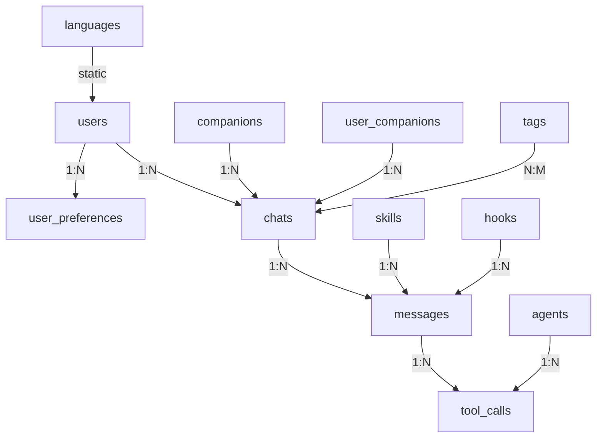
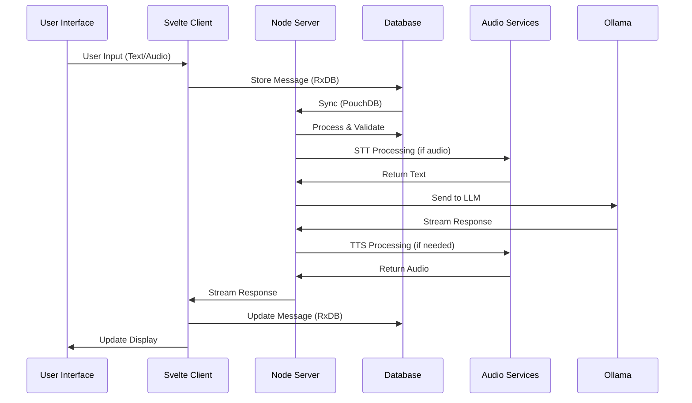
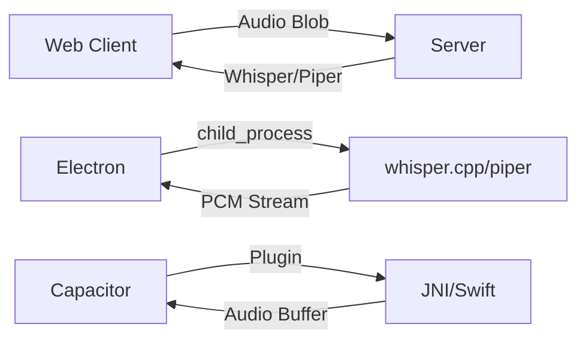
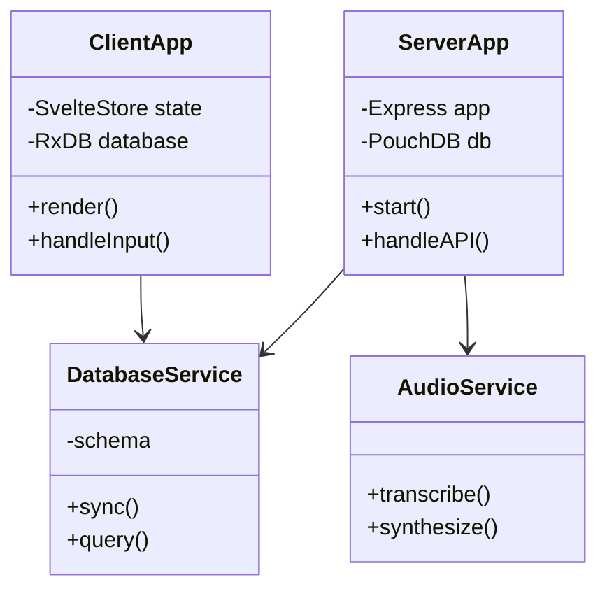

# Wollama - Technical Audit & Architecture Documentation

## 1. Project Structure Analysis

### Current Structure
```
wollama/
├── client/              # Svelte 5 frontend
│   ├── src/            # Source code
│   │   ├── lib/        # Core logic (db.ts, services/)
│   │   ├── routes/     # SvelteKit pages
│   │   └── components/ # UI components
│   ├── electron/       # Electron configuration
│   │   └── main.js     # Electron entry point
│   ├── android/        # Capacitor Android project
│   └── package.json    # Client dependencies
├── server/              # Node.js backend
│   ├── services/       # Business logic
│   │   ├── ollama.service.ts
│   │   ├── stt.service.ts
│   │   ├── tts.service.ts
│   │   └── generic.service.ts
│   ├── db/             # Database setup
│   │   └── database.ts # PouchDB configuration
│   ├── routes/         # API endpoints
│   └── package.json    # Server dependencies
├── shared/              # Shared code
│   └── db/             # Database schema & types
│       ├── database-scheme.ts  # Complete schema definition
│       └── schema-definition.ts # Type definitions
├── QWEN.md              # Development guide
├── PROJECT.md           # Project specifications
├── AGENTS.md            # Development workflow
└── package.json         # Root workspace config
```

### Key Files Reference

#### Client Application
- **Entry Point**: `client/src/App.svelte`
- **Database**: `client/src/lib/db.ts` (RxDB setup)
- **State Management**: `client/src/lib/state/` (Svelte stores)
- **Services**: `client/src/lib/services/` (API clients)
- **Electron**: `client/electron/main.js` (Main process)
- **Capacitor**: `client/capacitor.config.ts` (Mobile config)

#### Server Application
- **Entry Point**: `server/server.ts` (Express setup)
- **Database**: `server/db/database.ts` (PouchDB config)
- **Ollama Service**: `server/services/ollama.service.ts`
- **STT Service**: `server/services/stt.service.ts`
- **TTS Service**: `server/services/tts.service.ts`
- **Generic Service**: `server/services/generic.service.ts`

#### Shared Code
- **Schema**: `shared/db/database-scheme.ts` (13 collections)
- **Types**: `shared/db/schema-definition.ts` (Field definitions)

## 2. Documentation Alignment Analysis

### QWEN.md vs PROJECT.md vs Current Code

#### Aligned Elements
- Monorepo structure matches documentation
- Core technologies consistent across all sources
- Database schema structure aligned
- Platform-specific audio strategies documented

#### Discrepancies Found

1. **Database Schema Details**
   - `QWEN.md`: Lists 11 collections
   - `PROJECT.md`: Describes similar but with different field details
   - `database-scheme.ts`: Most complete with 13 collections including `languages` and `tags`

2. **Build Commands**
   - `QWEN.md`: Shows `npm run dev:electron`
   - `package.json`: Uses `npm run electron:dev`
   - Client has `build:sidecar` for PyInstaller integration

3. **Testing Setup**
   - `QWEN.md`: Describes Vitest for both client and server
   - `PROJECT.md`: No testing mention
   - Client: Vitest (v4.0.15) with @playwright/test
   - Server: Vitest with unit tests

4. **Mobile Configuration**
   - `PROJECT.md`: Mentions Capacitor
   - Client: Has @capacitor/android (v8.0.0) and @capacitor/core (v8.0.0)
   - No visible iOS configuration

## 3. Stale Information Identification

### Outdated Elements

1. **Build Commands**
   - Documentation shows `dev:electron` but actual is `electron:dev`
   - Missing `build:sidecar` documentation

2. **Testing Infrastructure**
   - No evidence of test files in structure
   - Testing tools installed but no visible test implementation

3. **Mobile Platform**
   - Capacitor Android present but no iOS setup
   - No mobile-specific implementation visible

### Missing Elements

1. **Current State Documentation**
   - No implementation status tracking
   - Unclear which features are functional

2. **Dependency Versions**
   - Documentation lacks specific version information
   - Actual versions: Svelte 5.45.6, Vite 7.2.7, Express 5.2.1

3. **Audio Implementation**
   - No visible STT/TTS service implementation
   - Server has ollama (v0.6.3) but no audio processing code

## 4. Architecture Recommendations

### Immediate Actions

1. **Update Documentation**
   - Correct build command references in `QWEN.md`
   - Add testing infrastructure documentation
   - Document current mobile setup in `PROJECT.md`

2. **Verify Build System**
   - Test all build scripts in `package.json` files
   - Verify Electron and Capacitor configurations

3. **Implement Testing**
   - Create basic test files for critical components
   - Set up CI/CD pipeline with test validation

### Long-term Improvements

1. **Automated Documentation**
   - Generate schema docs from `database-scheme.ts`
   - Keep `QWEN.md` and `PROJECT.md` in sync with code

2. **Feature Implementation**
   - Complete audio processing services (`stt.service.ts`, `tts.service.ts`)
   - Implement mobile platform support
   - Add iOS Capacitor configuration

3. **Quality Assurance**
   - Implement feature flags system
   - Add comprehensive error handling
   - Set up automated testing pipeline

## 5. Technical Schemas

### Database Schema Overview


### Data Flow Diagram


### Platform Audio Strategy


### Component Architecture


## 6. Detailed Schema Analysis

### Database Collections (from database-scheme.ts)

#### Core Collections
1. **users**: User accounts with UUID primary key
   - File: `shared/db/database-scheme.ts:users`
   - Fields: user_id, username, created_at, updated_at

2. **user_preferences**: User settings (theme, locale, server_url)
   - File: `shared/db/database-scheme.ts:user_preferences`
   - Fields: theme, locale, auto_play_audio, server_url, default_model

3. **companions**: AI personality configurations
   - File: `shared/db/database-scheme.ts:companions`
   - Fields: name, system_prompt, model, voice_id, mood, avatar

4. **user_companions**: Custom user companions
   - File: `shared/db/database-scheme.ts:user_companions`
   - Extends companions with user-specific overrides

5. **chats**: Conversation sessions
   - File: `shared/db/database-scheme.ts:chats`
   - Fields: title, tags, category, model, context

6. **messages**: Individual messages with status tracking
   - File: `shared/db/database-scheme.ts:messages`
   - Fields: role, content, status, audio_file_path, images, urls

7. **user_prompts**: Custom instruction templates
   - File: `shared/db/database-scheme.ts:user_prompts`
   - Fields: content, is_active, AI processing metadata

#### Support Collections
8. **languages**: Supported language codes
   - File: `shared/db/database-scheme.ts:languages`
   - Fields: code, name, flag

9. **tags**: Chat categorization
   - File: `shared/db/database-scheme.ts:tags`
   - Fields: name

#### Extensibility Collections
10. **skills**: Reusable functionality
    - File: `shared/db/database-scheme.ts:skills`
    - Fields: name, command, handler_type, scope

11. **agents**: External service integrations
    - File: `shared/db/database-scheme.ts:agents`
    - Fields: name, type, config, is_enabled

12. **hooks**: Event-driven extensions
    - File: `shared/db/database-scheme.ts:hooks`
    - Fields: event, handler_type, priority, scope

13. **tool_calls**: Agent execution logs
    - File: `shared/db/database-scheme.ts:tool_calls`
    - Fields: status, input, output, error, started_at

### Key Field Analysis

#### Message Collection
```typescript
// File: shared/db/database-scheme.ts:messages
{
    message_id: uuid (PK),
    chat_id: uuid (FK),
    role: 'system'|'user'|'assistant'|'tool',
    content: text-long,
    status: 'idle'|'done'|'sent'|'streaming'|'error',
    audio_file_path: string,
    images: array<object>,
    urls: array<object>,
    tool_call_id: uuid,
    skill_invoked: string,
    hook_log: array<object>
}
```

#### Companion Collection
```typescript
// File: shared/db/database-scheme.ts:companions
{
    companion_id: uuid (PK),
    name: string,
    system_prompt: text-long,
    model: string,
    voice_id: string,
    voice_tone: 'neutral'|'fast'|'slow'|'deep'|'high',
    mood: 'neutral'|'happy'|'sad'|'angry'|'sarcastic'|'professional'|'friendly'|'sexy',
    avatar: string,
    hooks: array<string>,
    skills: array<string>
}
```

## 7. Implementation Status

### Verified Components
- [x] Monorepo structure (`package.json` files)
- [x] Svelte 5 frontend setup (`client/package.json`)
- [x] Node.js backend setup (`server/package.json`)
- [x] Database schema definition (`shared/db/database-scheme.ts`)
- [x] TypeScript configuration (`tsconfig.json` files)
- [x] Build scripts (`package.json` scripts section)

### Partially Implemented
- [ ] Audio processing services (`server/services/stt.service.ts`, `server/services/tts.service.ts`)
- [ ] Mobile platform support (`client/android/`, missing iOS)
- [ ] Testing infrastructure (Vitest installed but no test files)
- [ ] CI/CD pipeline (No configuration files)

### Not Implemented
- [ ] iOS Capacitor configuration (No `client/ios/` directory)
- [ ] Comprehensive error handling (No visible error handling middleware)
- [ ] Feature flags system (No feature flag implementation)
- [ ] Automated documentation (No doc generation scripts)

## 8. Next Steps

### Priority 1 (Critical)
1. Verify and document build system (`package.json` scripts)
2. Implement basic testing infrastructure (Create test files)
3. Complete audio service implementation (`stt.service.ts`, `tts.service.ts`)
4. Document current implementation status (Update `ARCH.md`)

### Priority 2 (Important)
1. Set up CI/CD pipeline (Create GitHub Actions workflows)
2. Implement feature flags (Add feature flag system)
3. Complete mobile platform support (Add iOS Capacitor config)
4. Add comprehensive error handling (Add error middleware)

### Priority 3 (Enhancement)
1. Automated documentation generation (Create doc generation scripts)
2. Performance optimization (Profile and optimize)
3. Accessibility audit (Run RGAA 2.0 compliance checks)
4. Internationalization testing (Test all supported languages)

## 9. References

### Key Files
- **Client**: `client/package.json` (Svelte 5.45.6, Vite 7.2.7)
- **Server**: `server/package.json` (Express 5.2.1, PouchDB 9.0.0)
- **Schema**: `shared/db/database-scheme.ts` (13 collections)
- **Types**: `shared/db/schema-definition.ts` (Field definitions)
- **Electron**: `client/electron/main.js` (Main process)
- **Capacitor**: `client/capacitor.config.ts` (Mobile config)
- **Ollama**: `server/services/ollama.service.ts` (LLM integration)

### Documentation
- **QWEN.md**: Development guide with build commands
- **PROJECT.md**: Project specifications and architecture
- **AGENTS.md**: Development workflow and conventions
- **ARCH.md**: This technical audit document

### Dependencies
- **Client**: @capacitor/android (v8.0.0), rxdb (v16.21.1)
- **Server**: ollama (v0.6.3), fluent-ffmpeg (v2.1.3)
- **Shared**: TypeScript (v5.9.3), Vitest (v4.0.15)

### Build Commands
```bash
# Development
npm run dev:client       # Start Svelte frontend
npm run dev:server       # Start Node backend
npm run electron:dev     # Start Electron app

# Build
npm run build            # Build client
npm run build:sidecar    # Build PyInstaller sidecar
npm run package          # Package Electron app

# Testing
npm run test:client      # Run client tests
npm run test:server      # Run server tests

# Quality
npm run lint             # Run linter
npm run format           # Format code
```