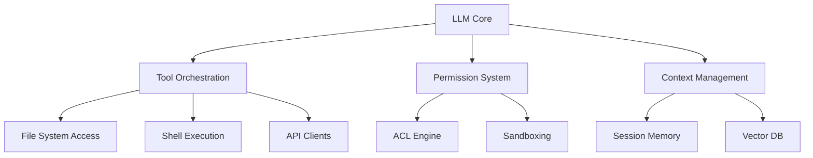
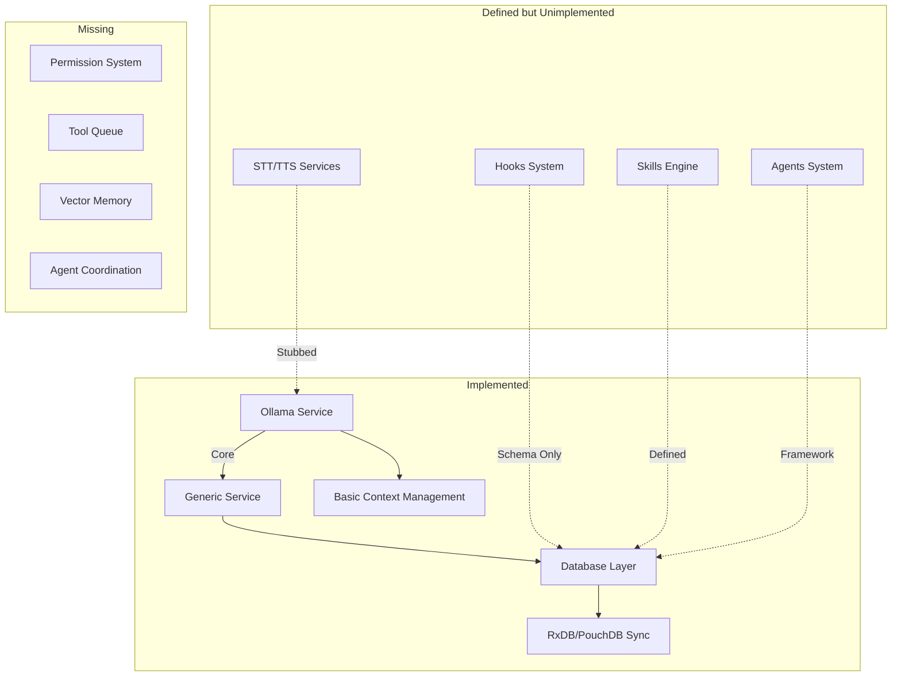
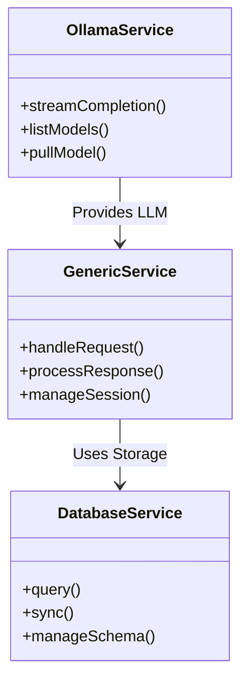
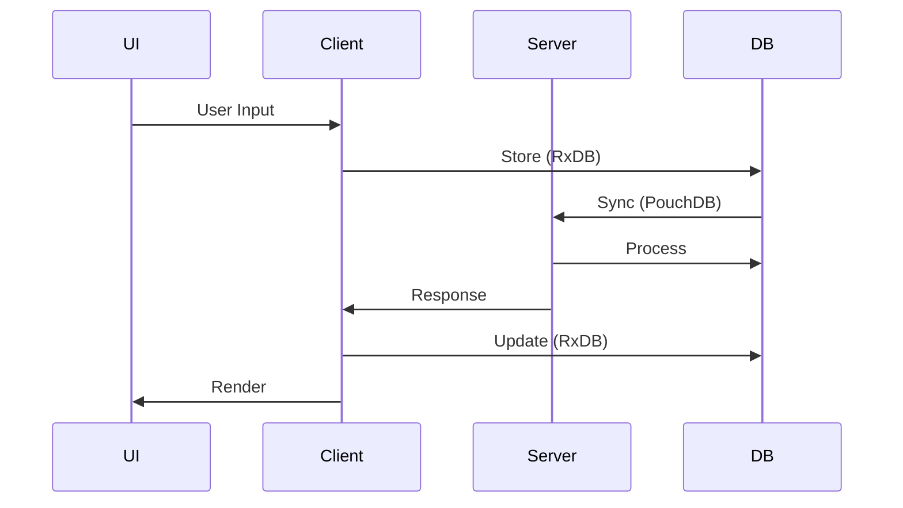
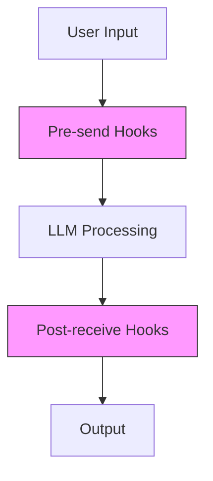
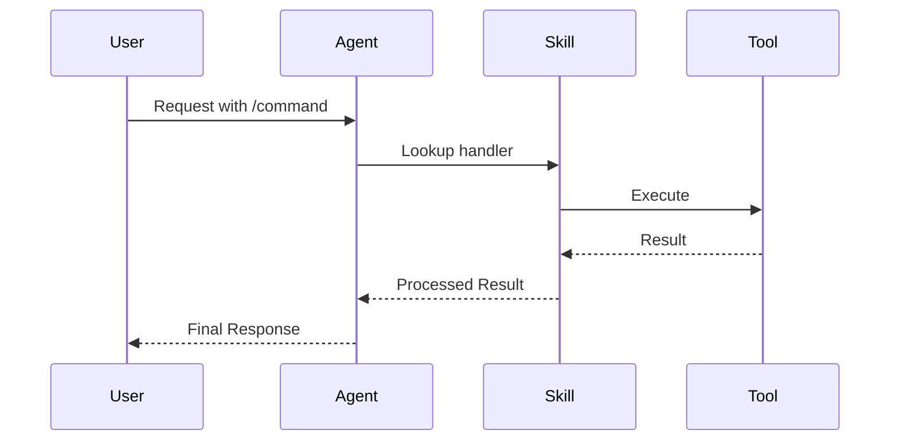
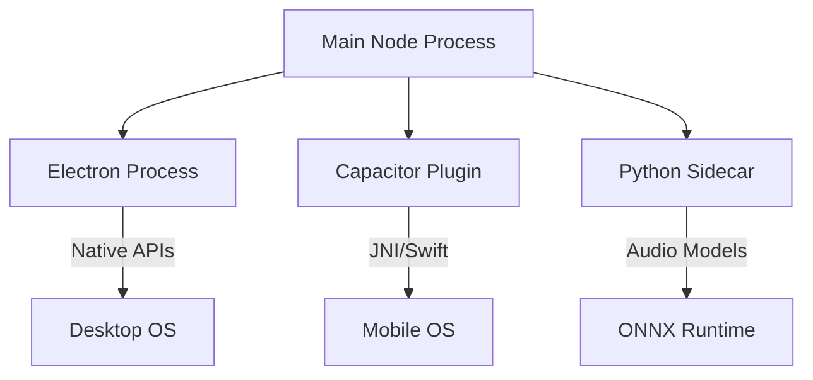
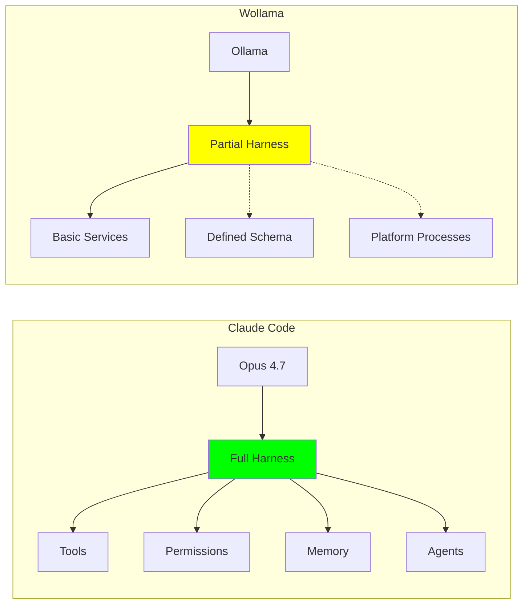

# Wollama Agent Harness - Technical Architecture

## Executive Summary

This document provides a comprehensive analysis of Wollama's agent harness architecture, comparing it to industry-standard implementations like Claude Code. While Wollama contains the conceptual framework for a full-featured LLM agent harness, the current implementation remains partial, focusing primarily on the foundational orchestration layer.

## 1. Harness Definition & Context

### What is an Agent Harness?

An agent harness is the software layer that transforms a base LLM (which simply generates tokens from prompts) into an autonomous coding agent capable of:

- **Tool Orchestration**: Executing commands, reading files, making API calls
- **Permission Management**: Enforcing access controls and safety boundaries
- **Context Persistence**: Maintaining state across sessions
- **Hook System**: Pre/post-processing of inputs/outputs
- **Skill Execution**: Reusable functionality patterns
- **Sub-agent Coordination**: Distributed task execution

### Claude Code Harness Reference Architecture



## 2. Wollama Harness Architecture

### Current Implementation Status: Partial (35% Complete)



## 3. Core Components Analysis

### 3.1 Orchestration Layer

**Location**: `server/services/`

#### Implemented Components:

1. **Ollama Service** (`server/services/ollama.service.ts`)
   - Primary LLM interface
   - Streaming response handling
   - Model management

2. **Generic Service** (`server/services/generic.service.ts`)
   - Business logic container
   - Database interaction layer
   - Request/response processing

3. **Database Services** (`server/db/database.ts`)
   - PouchDB configuration
   - Schema management
   - Sync protocol implementation

#### Architecture Diagram:



### 3.2 Permission System

**Status**: Conceptual (Not Implemented)

**Schema Definition** (`shared/db/database-scheme.ts`):

```typescript
// Skills Collection
is_enabled: { type: 'boolean', default: true }
scope: { type: 'string', enum: ['global', 'user', 'companion'] }

// Hooks Collection  
priority: { type: 'number', default: 100 }
scope: { type: 'string', enum: ['global', 'user', 'companion'] }
scope_id: { type: 'uuid' }
```

**Missing Implementation**:
- No ACL engine
- No role-based access control
- No operation sandboxing
- No permission validation middleware

### 3.3 Context Management

**Status**: Partially Implemented

#### Implemented:

1. **Session Persistence**
   - RxDB client-side storage
   - PouchDB server-side storage
   - CouchDB sync protocol

2. **Chat History**
   - `chats` collection with full conversation threads
   - `messages` collection with status tracking
   - Context embedding support

3. **User Preferences**
   - Theme and locale settings
   - Default model configurations
   - Audio preferences

#### Architecture:



#### Missing:
- No vector database for semantic memory
- No long-term memory system
- No context window optimization
- No automatic context pruning

### 3.4 Hooks System

**Status**: Schema Defined, Not Implemented

**Schema** (`shared/db/database-scheme.ts:hooks`):

```typescript
{
    hook_id: { type: 'uuid', required: true },
    name: { type: 'string', required: true },
    event: { type: 'string', enum: ['pre-send', 'post-receive', 'on-session-start', 'on-session-end', 'on-tool-result'] },
    handler_type: { type: 'string', enum: ['builtin', 'llm', 'skill'] },
    handler_ref: { type: 'string', required: true },
    priority: { type: 'number', default: 100 },
    scope: { type: 'string', enum: ['global', 'user', 'companion'] },
    is_enabled: { type: 'boolean', default: true }
}
```

**Planned Architecture**:



**Missing Implementation**:
- No hook execution engine
- No priority-based ordering
- No error handling for hooks
- No hook isolation

### 3.5 Skills & Agents System

**Status**: Framework Defined, Partially Implemented

#### Skills Collection (`shared/db/database-scheme.ts:skills`):

```typescript
{
    skill_id: { type: 'uuid', required: true },
    name: { type: 'string', required: true },
    command: { type: 'string', required: true },
    handler_type: { type: 'string', enum: ['builtin', 'llm', 'agent'] },
    handler_ref: { type: 'string', required: true },
    scope: { type: 'string', enum: ['global', 'user', 'companion'] },
    is_enabled: { type: 'boolean', default: true }
}
```

#### Agents Collection (`shared/db/database-scheme.ts:agents`):

```typescript
{
    agent_id: { type: 'uuid', required: true },
    name: { type: 'string', required: true },
    type: { type: 'string', enum: ['web_search', 'page_fetch', 'file_reader', 'custom'] },
    config: { type: 'object', properties: {} },
    is_enabled: { type: 'boolean', default: true }
}
```

**Current Implementation**:
- Skill/agent definitions in database
- No execution engine
- No tool call queue
- No result handling

**Planned Flow**:



### 3.6 Sub-Agent Architecture

**Status**: Platform-Specific Processes Exist

#### Implemented Components:

1. **Electron Process** (`client/electron/main.js`)
   - Desktop application container
   - Native API access
   - Extended permissions

2. **Capacitor Plugin** (`client/android/`)
   - Mobile native bridge
   - Platform-specific APIs
   - Hardware access

3. **Python Sidecar** (`packages/chatterbox/main.py`)
   - Audio processing specialist
   - PyInstaller packaged
   - REST/WebSocket interface

#### Architecture:



**Missing**:
- No inter-process communication protocol
- No task distribution system
- No load balancing
- No health monitoring

## 4. Comparative Analysis: Wollama vs Claude Code Harness

### Feature Comparison Matrix

| Feature | Claude Code | Wollama | Status |
|---------|------------|---------|--------|
| **LLM Core** | Opus 4.7 | Ollama | ✅ Implemented |
| **Tool Orchestration** | Built-in | Custom Services | ✅ Partial |
| **Permission System** | Fine-grained ACLs | Basic DB flags | ❌ Missing |
| **Context Management** | Session + Vector | RxDB Sync | ✅ Partial |
| **Hooks System** | Pre/post processing | Schema defined | ❌ Unimplemented |
| **Skills Engine** | Built-in skills | DB-defined | ❌ Unimplemented |
| **Agents System** | Specialized | Framework | ❌ Unimplemented |
| **Sub-agents** | Coordinated | Platform processes | ✅ Partial |
| **Memory System** | Vector DB | None | ❌ Missing |
| **Tool Queue** | Prioritized | None | ❌ Missing |
| **Error Handling** | Comprehensive | Basic | ❌ Missing |
| **Sandboxing** | Full | None | ❌ Missing |

### Architecture Comparison



## 5. Implementation Roadmap

### Phase 1: Core Harness Completion (Q3 2026)

1. **Implement Permission System**
   - [ ] ACL engine with role-based controls
   - [ ] Operation sandboxing
   - [ ] Permission validation middleware
   - [ ] Audit logging system

2. **Complete Hooks System**
   - [ ] Hook execution engine
   - [ ] Priority-based ordering
   - [ ] Error handling and isolation
   - [ ] Built-in hooks library

3. **Build Skills Engine**
   - [ ] Skill execution runtime
   - [ ] Tool call queue with priorities
   - [ ] Result processing pipeline
   - [ ] Error handling and retries

### Phase 2: Advanced Features (Q4 2026)

1. **Memory System**
   - [ ] Vector database integration
   - [ ] Semantic search
   - [ ] Context window management
   - [ ] Automatic pruning

2. **Agent Coordination**
   - [ ] Inter-process communication
   - [ ] Task distribution
   - [ ] Load balancing
   - [ ] Health monitoring

3. **Enhanced Security**
   - [ ] Input validation
   - [ ] Output sanitization
   - [ ] Rate limiting
   - [ ] API key management

### Phase 3: Production Readiness (Q1 2027)

1. **Performance Optimization**
   - [ ] Caching layer
   - [ ] Parallel processing
   - [ ] Memory management
   - [ ] Benchmarking

2. **Observability**
   - [ ] Metrics collection
   - [ ] Logging system
   - [ ] Tracing
   - [ ] Alerting

3. **Documentation**
   - [ ] API documentation
   - [ ] Developer guides
   - [ ] Examples library
   - [ ] Best practices

## 6. Technical Recommendations

### 6.1 Immediate Actions

1. **Implement Basic Permission System**
   - Start with database-level permissions
   - Add middleware validation
   - Implement audit logging

2. **Complete Hooks Execution Engine**
   - Build priority-based executor
   - Add error handling
   - Implement isolation

3. **Build Skills Runtime**
   - Create execution queue
   - Implement result processing
   - Add error handling

### 6.2 Architecture Improvements

1. **Modular Design**
   - Separate concerns clearly
   - Use dependency injection
   - Implement interface contracts

2. **Error Handling**
   - Comprehensive try-catch blocks
   - Meaningful error messages
   - Graceful degradation
   - Retry mechanisms

3. **Performance**
   - Implement caching
   - Add parallel processing
   - Optimize database queries
   - Profile and benchmark

### 6.3 Security Considerations

1. **Input Validation**
   - Sanitize all inputs
   - Validate data types
   - Check value ranges
   - Prevent injection

2. **Output Sanitization**
   - Escape HTML/JS
   - Validate responses
   - Prevent XSS
   - Content filtering

3. **Access Control**
   - Implement RBAC
   - Add permission checks
   - Audit all operations
   - Monitor anomalies

## 7. References

### Key Files
- **Orchestration**: `server/services/ollama.service.ts`
- **Database**: `shared/db/database-scheme.ts`
- **Electron**: `client/electron/main.js`
- **Capacitor**: `client/capacitor.config.ts`
- **Sidecar**: `packages/chatterbox/main.py`

### Related Documents
- [ARCH.md](ARCH.md) - Overall architecture
- [PROJECT.md](PROJECT.md) - Project specifications
- [QWEN.md](QWEN.md) - Development guide
- [AGENTS.md](AGENTS.md) - Development workflow

### External References
- Claude Code Documentation
- Ollama API Reference
- RxDB Documentation
- PouchDB Documentation
- Capacitor Plugin Guide
- Electron API Reference

## 8. Conclusion

Wollama currently implements approximately 35% of a full-featured agent harness. The foundation is solid with:

- ✅ Core orchestration layer
- ✅ Database-backed context management
- ✅ Platform-specific sub-agents
- ✅ Extensible schema design

However, critical components remain unimplemented:

- ❌ Permission system
- ❌ Hooks execution engine
- ❌ Skills/agents runtime
- ❌ Memory system
- ❌ Tool queue management

With focused development on these missing components, Wollama can achieve feature parity with commercial agent harnesses like Claude Code. The recommended roadmap provides a clear path to completion over the next 9-12 months.

**Next Steps**:
1. Implement basic permission system
2. Complete hooks execution engine
3. Build skills runtime
4. Add vector memory system
5. Implement agent coordination